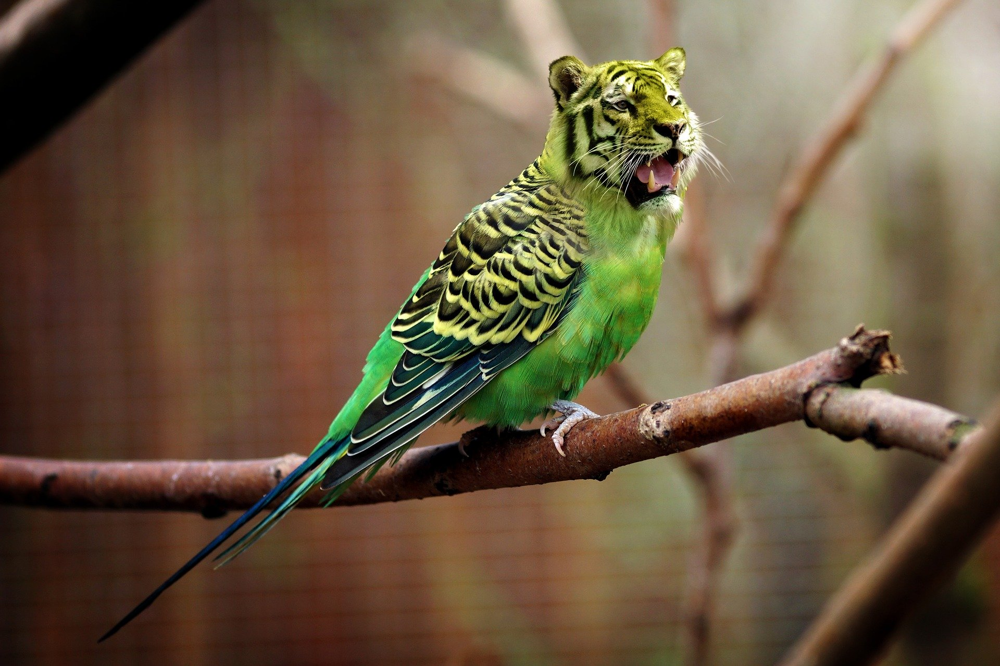

# Analyse einer Kreuzung - Vergleich von Machine Learning zu Nicht-Machine-Learning Methoden

# Teammitglieder
Listen Sie hier noch einmal alle Teammitglieder mit Namen auf.

- Mohammad Albittar
- Noah Kasten
- Mostafa Mahmoud
- Jan Sbiegay

# Projektbeschreibung
Laut §9 der Prüfungsordnung ist die Prüfungsform die "Erstellung und Dokumentation von Rechnerprogrammen"

Die Erstellung und Dokumentation von Rechnerprogrammen umfasst in der Regel

1. die Beschreibung der Aufgabe und ihrer Abgrenzung,
2. die Erarbeitung theoretischer Voraussetzungen für die Bearbeitung der Aufgabe, insbesondere die Auswahl der geeigneten Methoden unter Einbeziehung und Auswertung einschlägiger Literatur,
3. die Formulierung der verwendeten Algorithmen in einer geeigneten Programmiersprache,
4. das Testen des Programms mit mehreren exemplarischen Datensätzen und das
Überprüfen der Ergebnisse auf ihre Richtigkeit,
5. die Programmdokumentation insbesondere mit Angabe der verwendeten Methoden,
des Ablaufplans, des Programmprotokolls (Quellenprogramm) und des Ergebnisprotokolls.

Bitte gehen Sie im Folgenden auf die oben genannten Punkte ein.

Die Ausarbeitung sollte sich im Idealfall wie ein wissenschaftlicher Artikel lesen, den man in einer Fachzeitschrift veröffentlichen könnte (und vielleicht machen wir dies auch, wenn Sie wollen).
Als Hilfestellung haben wir Ihnen typische Fragen in die jeweiligen Abschnitte geschrieben, welche natürlich innerhalb des Abschnittes möglichst beantwortet werden sollten. Die Angabe der Satzanzahl dient nur der Orientierung und muss nicht strikt befolgt werden. Ggf. für den besseren Lesefluss kann es auch sinnvoll sein Fragen zusammenzufassen oder wegzulassen. Dies ist gestattet, muss aber Sinn ergeben.

Als Sprache sind englisch oder deutsch erlaubt.

Anstatt in dieser ReadMe zu arbeiten, dürfen Sie auch ein PDF-Dokument erzeugen, z.B. mit LaTeX. In diesem Falle verlinken Sie bitte an dieser Stelle das entsprechende Dokument und legen alle zur Erstellung notwendigen Ressourcen in dem separaten Ordner *resources* ab.

## 1. Aufgabe und Abgrenzung
Dieser Abschnitt soll eine Art Überblick über den Rest der Arbeit bieten.

* Was ist das von Ihnen angegangene Problem. (1-2 Sätze)
* Warum ist dieses relevant? (1-2 Sätze)
* Was ist der wissenschaftliche Mehrwert Ihrer Arbeit? (1-3 Sätze)
* Kurzbeschreibung Ihres Ansatzes? (2-3 Sätze)
* Wie haben Sie Ihren Ansatz getestet? (1-2 Sätze)
* Was für nennenswerte Ergebnisse haben Sie erzielt? Bspw. 43% schneller, robuster als andere, etc.
* Überblick über ihr weiteres Vorgehen, welches unten beschrieben wird. (3-5 Sätze)

Mit diesem Projekt soll das Tracken vom Fahrzeugen in einer Kreuzung für die weitere Analyse der Straßensituation ermöglicht werden. Dazu werden einerseits Techniken mit traditionellen Verfahren der OpenCV-Bibliothek mit der Machine-Learning Methode YOLO verglichen. Dadurch soll herausgefunden werden, wie sich die Ergebnisse beider Ansätze unterscheiden und anschließed diskutiert werden, ob und wie sich diese gewinnbringend ergänzen können. **(wissenschaftlicher mehrwert)**.
Für die Analyse der Kreuzung soll der Straßenverlauf erkannt werden, um die Verläufe des Verkehrsflusses anhand der gefahrenen Wege festzustellen. Dazu sollen an jeder Ein- bzw. Ausfahrt der Kreuzung automatisch Linien erkannt werden. Über die Mittelpunkte der getracktet Fahrzeuge können dann Abstände zu diesen Linien berechnet werden, die für das Zählen der Überquerten Linien verwendet werden. Mit diesen Daten kann anschließend der Verkehrsfluss, die Verkehrsdichte und die mittlere Geschwindigkeit in der Kreuzung erfasst werden.
**(test)
(ergebnisse)**

## 2. Theoretische Grundlagen und Methoden mit entsprechender Literaturangabe
- https://www.sciencedirect.com/science/article/pii/S0031320300000145#FIG3
- https://www.sciencedirect.com/science/article/pii/S0167865502001940?ref=pdf_download&fr=RR-2&rr=85d0c9f509504510#FIG1
- https://docs.ultralytics.com/
- Motion Extraction (https://www.youtube.com/watch?v=NSS6yAMZF78)
- Grundlage OpenCV Objekterkennung (https://youtu.be/O3b8lVF93jU)
- Grundlage OpenCV Objekterkennung (https://github.com/dhananjaymenon/SpeedRadar-OpenCV-/blob/a8934ab99dd8dd6f891f3b60faa03806751c5944/tracker2.py)
- Grundlage OpenCV Objekterkennung (https://github.com/dhananjaymenon/SpeedRadar-OpenCV-/blob/a8934ab99dd8dd6f891f3b60faa03806751c5944/SpeedRadar2.py)

Klassische Ansätze versuchen bewegte Objekte über verschiedene Methoden zu Segmentieren und zu erkennen. Ausgehend von dieser Idee, versuchen wir bewegte Objekte von einem unbewegten Hintergrund zu trennen. 


* Worauf bauen Sie auf?
* Welche Literatur ist für Ihre Arbeit relevant? Dazu zählt nicht nur welche Sie verwendet haben, sondern auch, welche Arbeiten ähnliche Ziele wie Sie angehen.
* Worin unterscheiden sich diese von Ihrer Arbeit?

## 3. Formulierung des Vorgehens / Algorithmen


* <u>Ziele:</u> Bei jedem Ziel werden klassische Lösungsmöglichkeiten mit Machine Learining Lösungen verglichen
   * Fahrzeuge je Minute erkennen: 
      * Implementierung eines Algorithmus, der erkennt wieviele Fahrzeuge die Minute über die Kreuzung fahren

   * Verkehrsfluss Heatmap: 
      * Visualisierung des Verkehrsflusses der Kreuzung um eventuelle Muster und Intensitäten zu identifizieren

   * Mittlere Geschwindigkeit: 
      * Berechnung der mittleren Geschwindgkeit der erkannten Objekte
* Zunächst wurden mehrere Methoden für die Segmentierung untersucht, um die Objekte von dem Hintergrund zu trennen und eine Objekt-/ oder Hintergrundmaske zu erhalten
  
   * ERGEBNISSE VON JEDEM MIT DEN JEWEILIGEN FUNKTIONEN

      * Ergebniss
      * Motivation
      * Bewertung Ergebnis
     
   * Noah

Für das Erkennen und Verfolgen der Fahrzeuge mit OpenCV wurde unter Zuhilfenahme eines externen Ansatzes (siehe Theoretische Grundlagen) ein erster Ansatz entworfen. Dazu durchläuft das Programm eine Schleife über jeden Frame des zu analysierenden Videos. Über die CV-Funktion *findContours()* können dann ausgehendend von einer binären Maske bewegte Objekte im Video gefunden und mit der Funktion *boundingRect()* von einem Rechteck (Bounding-Box) umschlossen werden. Die weitere Objektverarbeitung erfolgt anschließend über die Klasse *Objecttracking()*, die in der *functions_n.py* definiert ist. Die Verwendung einer Klasse ist vorteilhaft, da für verschiedene Quellen andere Parameter benötigt werden und somit einfach ein neues Klassenobjekt angelegt werden kann.

In dieser Klasse wurde die Funktion *add_new_vehicle()* erstellt. Über diese Funktion soll sichergestellt werden, dass die in jedem Frame erkannten Objekte zu einem Fahrzeug zugeordnet werden, um den Weg des Fahrzeugs zu verfolgen. Dazu werden zuerst für jeden Frame die Mittelpunkte der Bounding-Boxes berechnet. Anschließend wird der Abstand zwischen diesen Punkten bestimmt. Ist der Abstand klein genug, wird angenommen, dass das erkannte Objekt das gleiche Fahrzeug ist, andernfalls wird eine neue Fahrzeug-ID vergeben. Hierbei ist eine qualifizierte Erkennung durch die Maske grundlegend für die Funktionalität. Die Mittelpunkte, Bounding-Boxes und Fahrzeug-ID werden im Video visuell dargestellt (siehe MP_BB_ID).
<center></center>

Um nun den Weg der Fahrzeuge für die Analyse des Verkehrsflusses in der Kreuzung aufzuzeichnen, wurde die Funktion *dist_to_line()* erstellt. Mit dieser Funktion kann der Abstand des Mittelpunktes zu einer Linie bestimmt werden. Die 4 Einmündungen in die Kreuzung stellen jeweils eine mögliche Linie, die ein Fahrzeug überqueren kann, dar (siehe Veranschaulichung_Linien). Wenn ein Fahrzeug erstmalig über eine Linie fährt, wird diese Linie als Einfahrt in die Kreuzung in einem Array *„car_in_out“* gespeichert. Bei der zweiten Überquerung einer anderen Linie wird diese Linie als Ausfahrt aus der Kreuzung abgespeichert. Somit sollen alle Fahrtwege der Fahrzeuge identifiziert werden, sofern das Verfolgte Objekt nicht "verloren" geht. 

<center></center>

Aufgrund der unzureichenden eindeutigen Erkennung der Fahrzeuge wurde die Funktion *point_inside_polygon()* definiert. Hiermit soll verhindert werden, dass innerhalb der Kreuzung bzw. der Linien neue Fahrzeug-IDs vergeben werden, damit zu jedem Fahrzeug eine Ein- und eine Ausfahrt erkannt wird. In der Funktion wird dazu überprüft, ob sich der Mittelpunkt des Fahrzeugs innerhalb des Bereichs befindet. Ist dies der Fall, wird in der Funktion *add_new_vehicle()* keine neue ID vergeben (siehe Veranschaulichung_p_in_p). 
<center></center>
Um den Rechenaufwand zu reduzieren, wird der gesamte Bildausschnitt auf eine „region of interest“ (roi) beschränkt. Für das Erstellen der roi wurde vorerst die Funktion *set_roi()* definiert. Diese ermöglicht, durch das Aufrufen der Funktion *mouse_callback()* und der Funktion *Image_from_Video()*, das manuelle Anklicken und Abspeichern von zwei Eckpunkten eines Rechtecks (siehe Veranschaulichung_set_roi). 
<center></center>

   * Mostafa

Neben dem Nutzer definierten ROI, wird auch ROI automatsich bestimmt. Dabei wurde eine Methode zum Extrahieren den Vier Eckpunkten des ROIs entwickelt. Dafür wurde 3 Funktionen geschrieben, extract_background(), find_Stats_point() und find_rois_points().

Die Grundidee zum Berechnen der ROI Eckpunkte ist das Erkennen von an der Ampel stillstehenden Autos und dadurch Punktwolken zu erzeugen. Aus den Punktwolken können dann die Schwerpunkte bestimmt werden. Die Schwerpunkten der Punktwolken sollen bei einer typisch Ampelkreuzung auf der 4 Seiten des ROIs rechtecks liegen.

Um die stehenden Autos zu erkennen, muss eine Maske erstellt werden, die nur still stehende Autos erkennt. Für die Erzeugung der Maske werden zwei andere Masken miteinander verglichen, diese sind:
* Maske für bewegende Autos
* Maske für bewegende und still stehende Autos

Die erste Maske lässt sich durch hauptsächlich 2 OpenCV Funktionen berechnen, createBackgroundSubtractorKNN() und createBackgroundSubtractorMOG2(). Lediglich createBackgroundSubtractorKNN() wird verwendet, da es durch Experiementieren zu besseren Ergebnisse geführt hat. Die Berechung der zweiten Maske erfolgt durch den Vergleich zwischen dem Hintergrundbild und dem aktuellen Frame. Die Erzeugung des Hintergrundbilds geschieht in der selbst definierten Funktion, extract_background(). In der Funktion wird das Video Capture gesamplet. Von den gesampleten Frames wird der Median berechnet, was dann  den Hintergrund ergibt. Die Ergebnisse dieser Funktion werden dann für die folgende funktion, find_Stats_point(), verwendet. Diese Funktion ergibt als Output Punkten, wo im Video Fahrzeugen Standen. In der Funktion wird zuerst eine Differenz Maske erstellt. Die Maske ist die Differenz zwischen dem zuvor erzeugten Hintergrund Bild und dem aktuellen Frame. Dadurch werden alle Autos erkannt.
<center></center>

Von dieser Maske werden nun die bewegenden Autos subtrahiert. Durch createBackgroundSubtractorKNN() lassen sich die bewegenden Autos erkennen. Die erkannten Punkte werden in der Diff Maske identifiziert und auf Null gesetzt. Damit erhält man das Folgende:
<center></center>
<center></center>

Zum Erkennen von Autos wird die OpenCV Funktionen verwendet, findContours(), und wird die Fläche berechnet. Nur die Fläche über eine bestimmten Threshold, was empirisch ermittelt wurde, werden als Objekt erkannt. Der Grund dafür ist, das kleine unerwüschte Störungen nicht erkannt werden. Um den Contours wird ein Rechteck gezeichnet und der Mittelpunkt des Reckteckes berechnet, gezeichnet und gespeichert.
<center></center>

Von dem gespeicherten Mittelpunkten werden in find_rois_points() die Schwerpunkten der Punktwolken gerechnet. Hier wird dafür der Kmeans clustering Algorithmus verwendet.
<center></center>

Die Centerroids sollen auf den vier Seite des ROIs Rechtecks liegen. Linien werden aus dem Vier Centerriods gezeichnet. Die Schnittpunkten der Linien entsprechend die Eckpunkten des ROIs und werden als Output ausgegeben. 
<center></center>

   * Jan
Vergleich der Verschiedenen Methoden für die Hintergrundsegmentierung. Hier wurden die Verschiedenen Umsetzungen von dem OpenCV internen BackgroundSubtractor getestet, MOG2, KNN, CNT und GMG. Die Verschiedenen Umsetzungen lieferten gemischte Ergebnisse, da gelegentlich der Output flackerte oder wenn Autos über lägere Zeit still standen diese als Hintergrund klassifiziert wurden und somit aus der Ausgabe verschwanden. Dies hat den Hintergrund, dass die Umsetzungen des BackgroundSubtractor mit einer History arbeiten und hierbei jedem Pixel einen, auf Wahrscheinlichkeit über die Bildhistorie betrachtet, basierenden Wert zuweisen.
<center></center>
Als nächstes wurde eine weitere Methode für die Motion Extraction aus Video getestet. Diese Methode basiert auf der Idee der Quelle [Quelle]. Hierbei werden zwei aufeinander folgende Frames miteinander verrechnet. Bewegt sich ein Objekt im Bild, entsteht eine Kante die um die Pixelwertänderung vom Mittelwert des Maximalwertes des Datentyps (Beispiel: Datentyp uint8 -> Mittelwert 128) abweicht. Subtrahiert man nun den Mittelwert vom Bild und bildet den Absoluter. so erhält man ein schwarzes Bild wo nur durch Bewegung erzeugte Kanten vom 0 Wert abweichen. Durch das zusätzliche Anwenden des OpenCV Threshholding Algorithmus auf das Ergebnis, kann Rauschen und minimale Änderungen rausgefiltert werden und man erhält eine binäre Masse mit "Bewegung" =1 und "Unbewegt" = 0. 
<center></center>
Anschließend wurde noch eine Umsetzung des Lukas Kanade Algorithmus für Dense Optical Flow von OpenCV getestet. Ziel war es, anhand eines Vektorfeldes einzelne bewegte Objekte im Bild zu segmentieren, und sich überlagernde Objekte anhand des Algorithmus zu differenzieren. Die Umsetzung hiervon war sehr rechenintensiv und langsam, weshalb für eine spätere eventuelle, alternative Verwendung unter anderem nur die Magnitude und der Winkel als Rückgabeparameter implementiert wurden. 
<center></center>

Um die unterschiedlichen Binärmasken aus den Ergebnissen der vorhergehenden FUnktionen zu verbessern, wurden unterschieliche Clustering Methoden betrachtet. Diese waren aber aufgrund einer sehr hohen Laufzeit, bedingt doch die große Menge an Punkten in den Punktwolken bei hoher Auflösung, nicht sinnvoll anwendbar oder brauchten zur initialisierung eine Anzahl der gewünschten Cluster, was in diesem Anwendungsfall nicht sinnvoll ist. 
Für die Umsetzung mit Machine Learning wurde YoloV8 ausgewählt, da dieses vergleichsweise sehr gut Dokumentiert war und die gegebenen Modelle ausreichend trainiert waren, sodass diese auf Anhieb funktionieren konnten. Hierfür wurden auf der Grundlage von zwei Online Beispielen zwei Umsetzungen getestet, explizit wurden die Modi Predict und Track getestet, jedoch waren für unseren Anwendungsfall hier keine gravierenden Unterschiede ersichtlich.<center></center>

   * Mohammad
      - Funktion: **Plotten.py**. Diese Funktion wurde entwickelt, um zwei Funktionen zu implementieren, die in der Verkehrsanalyse verwendet werden können. Die erste Funktion anzahlFahrzeugeProRichtung dient dazu, die Anzahl der Fahrzeuge pro Richtung (Einfahrt und Ausfahrt) zu zählen und in einem Balkendiagramm darzustellen. Die zweite Funktion anzahlFahrzeugeProMinute zielt darauf ab, die Anzahl der erkannten Fahrzeuge pro Minute für zwei verschiedene Erkennungsmethoden (in diesem Fall OpenCV und YOLO) zu berechnen und ebenfalls in einem Balkendiagramm anzuzeigen.
      - Funktion: **data_plot.py**. Diese Funktion wurde entwickelt, um eine Echtzeitvisualisierung der Anzahl der detektierten Fahrzeuge über die Zeit mithilfe von OpenCV zu ermöglichen. Die Motivation hinter diesem Code liegt darin, einen interaktiven und visuell ansprechenden Ansatz zur Überwachung des Fahrzeugverkehrs in Echtzeit bereitzustellen. Dies kann nützlich sein für die Überwachung von Verkehrssituationen, Analyse des Fahrzeugflusses oder Evaluierung von Detektionsalgorithmen. Leider macht diese Funktion das Programm langsamer und funktioniert die Darstellung der Graphen manchmal nicht.
      - Funktion: **1_mohammad_funktion_befahrene_strecke.py**. Diese Funktion wurde entwickelt, um einen Algorithmus zur Extraktion einer befahrenen Strecke aus einem Video bereitzustellen. Die Motivation hinter diesem Code liegt darin, eine automatisierte Methode zu schaffen, um befahrene Bereiche in einem Video zu identifizieren und dadurch ein Region of Interest automatisch zu finden.  
      Die Funktion hatte die Idee als Grundlage, ein Frame von einem beliebigen Frame mit festem Abstand abzuziehen, um als Resultat die unveränderten Pixels auf Null zu setzen und die Pixels, die eine Veränderung erfahren haben, in einem Array abzuspeichern. Danach werden die gespeicherten Arrays thresholder, um daraus binäre Werte zu bekommen. Danach gab es zwei Methoden die befahrenen Strecken zu extrahieren, entweder durch einfaches Addieren aller resultierenden Bilder mit anschließedem Thresholden, oder die einzelnen Pixels aller Bilder miteinander so zu vergleichen, dass die Pixels, die am meisten aufgetreten sind beizubehalten. Die erste Methode ist auf Grund nicht stabiler Aufnahme der Kreuzung gescheitert. Die zweite Methode hat nur an viel befahrenen Stellen gute Ergebnisse gezeigt, jedoch ist diese Methode extrem rechenintensiv aufgrund der Vergleich-Funktion.
      - Funktion: **2_mohammad_jan_function.py**. Diese Funktion ist die Weiterentwicklung der vorigen Funktion mit der Verwendung einer von Jan entwickelten Funktion names 'motion_extraction'. Jan's Funktion führt einer Subtraktion derart, dass ein Frame mit der Inverse eines anderen Frames zu addieren, nachdem die beiden Frames auf Grayscale konvertiert wurden. Dann erfolgt ein Thresholding ein Dilation, um die kleinen Lücken zu füllen. Danach werden die resultierenden Bilder einfach in einer Schleife zu einen einzigen Array zusammen addiert. Auf dieses Array wird in jeder Iteration die morphologische Funktion 'Öffnen' angewendet. Nach einer bestimmten Anzahl an Iterationen wird das resultierende Bild thresholded. Danach werden die Ecken in diesem Bild mithilfe der Funktion 'CannyEdge' erkannt und noch mal die morphologische Funktion 'Öffnen' angewendet. Am Ende werden die wesentlichen Linien durch die Funktion 'HoughLinesP' erkannt. . Diese Funktion hat bessere Ergebnisse als die vorige Funktion geliefert und einige Kanten der befahrenen Strecken konnten erkannt werden.


* Anschließend wurden die Ansätze mit den visuell besten Ergebnissen ausgewählt und zu dem folgenden Hauptprogramm zusammengefügt: 
  
   * Ergebnisbild Hauptprogramm
   * Begründung für die Auswahl der Ergebnisse
   * Verlauf von Frame-Input zu Ergebnis-Output
   


* Beschreiben Sie erneut knapp das Ziel ihres Projekts (1-3 Sätze)
* Geben Sie zunächst einen Überblick über Ihr Programm, gerne auch mit entsprechender Visualisierung. Sie können Bilder zur besseren Erläuterung wie folgt einfügen:  (3-5 Sätze)
* Motivieren Sie Ihren Ansatz! Warum denken Sie, dass dieser gut funktionieren wird? (2-4 Sätze)
* Was ist die genaue Eingabe- und Ausgabe Ihres Programms. (2-4 Sätze) Es ist völlig in Ordnung, wenn Sie sich auf den relevanten Teil konzentrieren und bspw. neben den Eingabebildern bereits perfekte (notfalls von Hand erzeugte) Vorder- und Hintergrundbilder erzeugen und als Eingabe nutzen. Erzeugen Sie sich die Eingabe, die Sie benötigen.
* Welche Annahmen verwenden Sie? Welche Annahmen verletzen Sie? Unter welchen Bedingungen sollte Ihr Ansatz definitiv funktionieren, wo wird er voraussichtlich Schwierigkeiten haben?
* Wie arbeitet ihr Programm? Welche Algorithmen wurden verwendet? Wie ist das Programm aufgebaut? Bitte konzentrieren Sie sich dabei auf die groben Konzepte, welche zum Verständnis notwendig sind und vermeiden Sie irrelevante Detailbeschreibungen.
* Wäre eine Tabelle für die Notationen hilfreich?
* Versuchen Sie eine sinnvolle Unterstruktur zu finden und vermeiden Sie alles in einen Abschnitt zu schreiben.
* Idealerweise wird jeder größere Schritt mit einem Beispiel validiert.
* Wenn Sie Bilder einbauen, stellen Sie sicher, dass die wichtigen Bereiche klar gezeigt werden (notfalls die wichtigen Bereiche vergrößern und separat darstellen)
* Erläutern Sie vor allem *warum* Sie etwas machen und nicht nur *was* sie machen.
* Erläutern Sie Ihren Ansatz vor allem zunächst theoretisch/verständlich und erst danach die Implementierung (falls diese überhaupt notwendig ist).


## 4. Evaluation

Die Funktion extract_background() funktioniert unter der Annahme, dass das Video ausreichende Lang ist. Beim kurzen Videos, wo Autos lange am Ampel stehen, werden die Stehende Autos als Teil des Hintergrund erkannt.
<center></center>

Die Funktion find_Stats_point() bietet unter beschränkten bedingungen relative gute Ergebnisse. Die Schwächen der Funktion resultieren aus der berechneten Maske zu Identifizierung der still stehenden Autos. Die Schwächen sind:
•	Fußgänger werden manchmal als Objekte identifiziert. Das passiert hauptsächlich, wenn ein Person an der Ampel, die am nächsten zu der Kamera ist, steht. Die erkannte Contour Fläche der Person ist größer als den definierten Threshold und das Person wird von dem Programm erfasst.
<center></center>
•	Staus, die nicht an der Ampel vorkommen, werden auch von der Maske erfasst. Das kann wie bei dem vorherigen Punkt zur Verschiebung des ROIs führen
 
•	Störungen von der Umgebung beispielweise, vom Wind (Kamerawackeln) oder von der Sonne (Änderung im Tageslicht). Die Störung verursachen Unterschiede zum Hintergrund Bild, was später von der Maske erfasst werden.
 <center></center>
•	Meherere nebeneinander stehende Autos werden als ein Objekt erkannt. Das ist aber für die Berechnung des ROIs nicht relevant, da die Position der Punkten hauptsächlich für die Berechnung benötigt wird. 

•	Fahrzeuge werden manchmal als meherere Objekte erkannt werden. Der Grund dafür lässt sich allerdings nicht erklären.
 
•	Manche Fahrzeuge, die hinter einem Objekt in dem Hintergrund stehen, werden nicht erkannt. Da die Contour Fläche wird durch den Hintergrund Objekt verdeckt. Das führt dazu, dass die übrig gebliebene Fläche nicht größer als den Threshold ist und das Objekt nicht erkannt wird.
 <center></center>

Der hauptsächliche Grund für die Schwächen lässt sich einfach durch die verwendete Methodik erklären. Der Methodik analysiert die Bewegungen in dem Frame und es wird nicht identifiziert, ob der Bewegung aus einem Auto oder anderen Objekt im Frame sind. Um die Schwächen zu beheben bzw. verringern soll zuerst eine Methodik zur akkuraten Identifizierung den Fahrzeugen erzeugt werden, Biespielweise mithilfe von Machine Learning. Und dazu auch die Bewegungsanalyse. Das ROI kann auch direkt mit anderen Machine Learnig algorithmus bestimmt werden, in dem das Algorithmus direkt den Ampelkreuzungsberich identifiziert.

Das Erfassen der Fahrzeuge mithilfe von OpenCV funktioniert unter der Annahme, dass die Objekte von der Maske fehlerfrei erkannt werden. Es wurden zwei Methoden für das Erstellen der Maske verwendet. Mit beiden Masken können die Objekte erfasst werden, sodass einzelne, einfache Fahrzeuge fehlerfrei detektiert werden (siehe Abbildung A). Letztendlich wurde sich aber für Methode 2 entschieden,da bei dieser weniger Fahrzeuge falsch erkannt wurden. Unter Zuhilfenahme der Funktion *point_inside_polygon()* können Fehlerkennungen, die bei komplexeren Fahrzeugen auftreten (siehe Abbildung B) eliminiert werden. Probleme treten vor allem bei der Erkennung von Fahrzeugen, die durch andere Fahrzeuge verdeckt werden, auf (siehe Abbildung C). <center></center>
Die Wegverfolgung der Fahrzeuge mit der Funktion *dist_to_line()* funktioniert ebenfalls unter der Annahme, dass die Fahrzeuge fehlerfrei erkannt werden. Dies ist in den meisten Fällen aber nur bei einzelnen, unverdeckten Fahrzeugen der Fall. Wenn dem Fahrzeug einmal eine neue ID aufgrund des Objektverlusts durch Fehler in der Maske zugewiesen wurde, wird die zweite Linienüberquerung, also die Ausfahrt, als erste Überquerung erkannt. Vermeiden lässt sich dies nur, indem das Fahrzeug über den gesamten Verlauf erkannt wird.
Dem zuvor beschrieben Objektverlust wirkt die Funktion *point_inside_polygon()* wie bereits beschrieben entgegen. Allerdings kann diese auch dazu führen, dass ein innerhalb der Kreuzung verdecktes Fahrzeug anschließend nicht mehr neu erkannt wird oder zwei erst in der Kreuzung neu erkannte Fahrzeuge dieselbe ID erhalten (siehe 2Autos_1ID). **dense optical flow usw**
<center></center>


(Insgesamt kann die Objekterkennung mit OpenCV unter der Voraussetzung eindeutig erkannter Objekte den Verkehrsfluss der Kreuzung besser als die Objekterkennung mit YOLO)


-  Getestet wurden mehrere Videos die über Youtube-Links oder als MP4 an das Programm übergeben wurden
   -  <u>Beispiellinks:</u>
      -  https://www.youtube.com/watch?v=2X27I6BAJcI
-  Hiermit sollte verdeutlich werden welche Stärken und Schwächen klassische Ansätze und derzeitige Machine Learning Ansätze haben
   -  <u>Klassisch:</u>
      -  Stärken und SChwächen einfügen
   -  <u>Machine Learning:</u>
      -  Stärken: 
         -  Es werden bewegte Objekte im Bildbereich erkannt und einer Klasse wie z.B. Auto, Motorradfahrer, Truck, Laster oder Fußgänger zugeordnet. Auch werden zwei Objekte bei kleineren Überschneidungen noch differenziert. Die Modelle funktionieren "Out-of-the-Box" sehr gut und müssen für den Anfang nicht zusätzlich nachtrainiert werden. 
      -  Schwächen: 
         -  Fehler können auftreten, wenn Fahrzeuge sich zu sehr überscheiden oder von in den Bildbereich ragenden Schildern, Laternen oder Ampeln teilweise verdeckt werden, wodurch Yolo das Fahrzeug während der Verdeckung als Instanz verliert und danach zwar wiedererkennt, aber als neue Insanz, was die Werte der Verkehrsanalyse verfälscht. 
   -  Abschließender Absatz: Was haben wir gezeigt, was konnten wir nicht zeigen
-  <u>Laufzeit:</u> 
   -  Klassisch FPS
   -  Machine Learning FPS (Loading + Inference + Postprocessing)
-  Limitierungen der Ansätze: 
   -  <u>Klassisch:</u>
   -  <u>Machine Learning:</u>
-  

​	


* Strukturieren Sie Ihre Ergebnisse!
* Auf welchen Datensätzen haben Sie ihr Programm getestet? (2-3 Sätze)
* Was wollten Sie damit zeigen? 
* Was konnten Sie damit zeigen? 
* Wie sind die Laufzeiten? (1-2 Sätze und optional Tabelle)
* Wie kann die Qualität der Ergebnisse gezeigt werden? (3-4 Sätze und optional Bilder und Tabellen)
* Wo sind Limitierungen? (2-3 Sätze und optional Bilder)
* Diskutieren Sie die Ergebnisse. 
* Schreiben Sie zuletzt eine Zusammenfassung, was Sie in diesem Projekt erreicht haben. (5-6 Sätze)
* Was hätte wie besser sein können? (1-2 Sätze)
* Wie könnte man den Ansatz erweitern oder weiter verbessern? (1-3 Sätze)
* Wer könnte von Ihrem Projekt profitieren? (1-4 Sätze)

## 5. Programmdokumentation
Dokumentieren Sie Ihren Quellcode leserlich und laden Sie alle relevanten Dateien und Datensätze in den "project"-Ordner hoch (sollte ihr Projekt mehr als 100MB verbrauchen, so legen Sie dieses bitte extern ab (bspw. GitHub, GDrive oder ähnliches) und verlinken dieses im "project"-Ordner.


# Arbeitsmatrix
Listen Sie hier alle relevanten Features als Liste mit sinnvoller Reihenfolge auf mit Angabe wer das Feature implementiert hat und zu welchem Anteil. Die Features sollen aus der Beschreibung des Projektes oben klar hervorgehen und nur die größeren Arbeitspakete umfassen (ca. 4-8 Features).
Bei starker Ungleicheit der Features behalten wir uns eine individuelle Notenvergabe vor.

Bspw.

- Systemarchitektur (Mohammad 0.0341 %)
- Main-Funktion (Noah 25 %, Jan x %  )
- Objekterkennung mit OpenCV (Noah 100 %)
- Fahrzeugweg tracken mit OpenCV (Noah 100 %)
- Backround Separation mit OpenCV Funktion()
- Backround Seperation mit auf anderen Wegen
- YOLOv8 (Jan x %)
- Lukas Kanade Funktion und Tests (Jan 100%)
- 

# Installation

```
git clone https://github.com/Mohammadalbittar/DBV_WS23-24.git
```

```
pip install -r requirements.txt
```

## Terminal Start Syntax

```
python main.py "file title" "path_to_file" [True/False -> Save Video File] [True/False -> Live Output] [FPS != INT i.e. 30]
```


## For Video and System Performance Output
Test the first 10 seconds of a demo video
```
python main.py "demo_title" 'resources/video2.mp4' True False 10
```

## For live Viewing with not Output
Just live view the result with no Saved File. Press Escape to abort
```
python main.py "" 'resources/video2.mp4' False True 0
```

